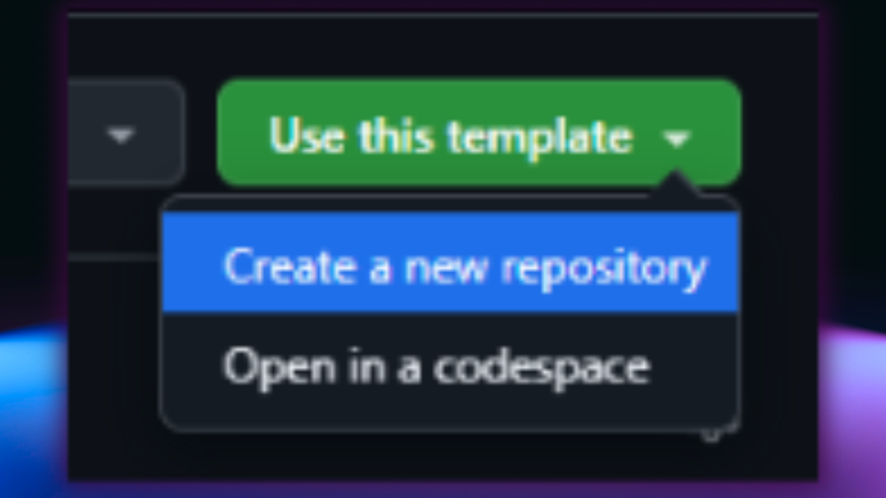
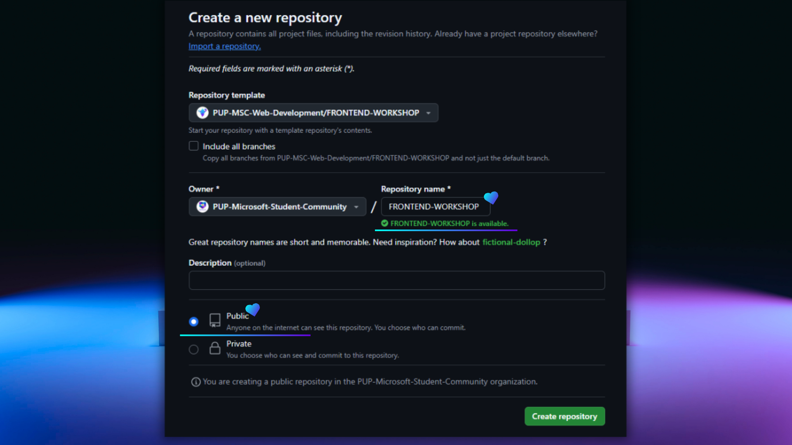
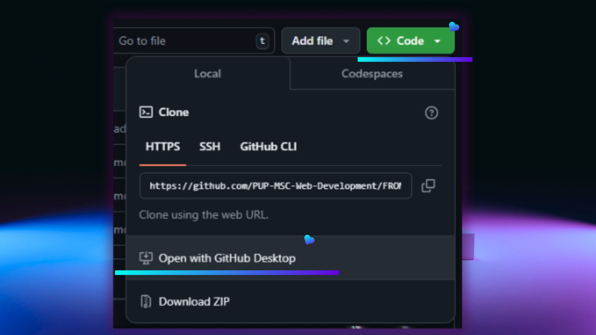
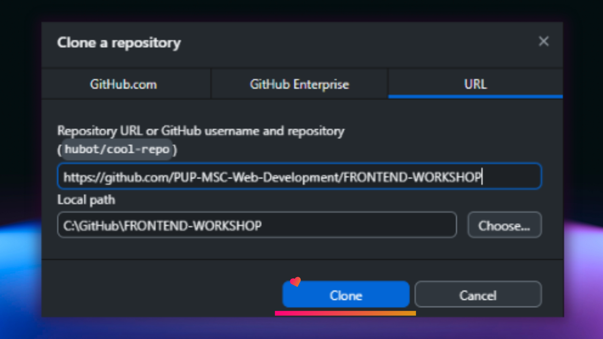
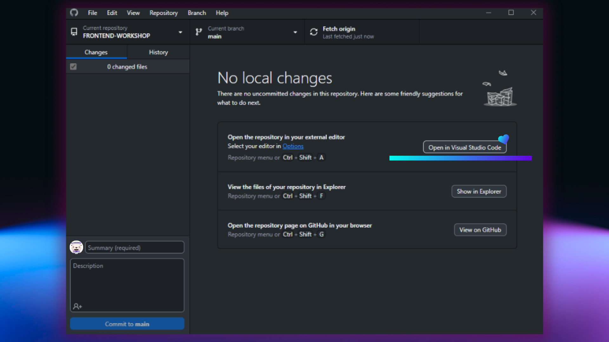
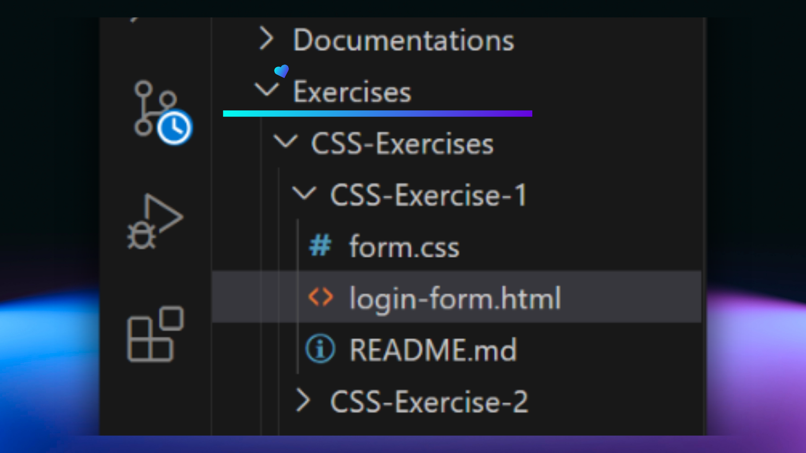

  
  <h1>
    .·´¯`·.·★ 😘 𝘾𝙇𝙄𝘾𝙆 𝙈𝙀, 𝙃𝙊𝙑𝙀𝙍 𝙈𝙀, 𝙇𝙊𝙑𝙀 𝙈𝙀! 😍 ★·.·`¯´·.
     

    
    
    
  

  </h1>

Welcome to PUP MSC's Frontend Web Development Training Repository where love at first click is just the beginning! Whether you're rekindling your passion for HTML, having a fling with CSS, or diving deep into a committed relationship with JavaScript, these reinforcement exercises are designed to make your coding journey unforgettable. 💘

________________

## 🧑‍💻 Exercises Overview

### **HTML**  
| **No.** | **Exercise**         | **Overview**                                                                                                                                                                      |
|---------|-------------------------|----------------------------------------------------------------------------------------------------------------------------------------------------------------------------------|
| 1       | Survey Form Project     | **Objective**: Create a simple survey form using HTML to gather user responses through text fields, multiple-choice questions, and checkboxes. Focus on using form elements and collecting user input effectively. |
| 2       | Tribute Page Project    | **Objective**: Build a tribute page using HTML to highlight an important individual, historical figure, or personal hero. Emphasize structured organization and key details using HTML elements. |

---

### **CSS** 
| **No.** | **Exercise**           | **Overview**                                                                                                                                                                      |
|---------|---------------------------|----------------------------------------------------------------------------------------------------------------------------------------------------------------------------------|
| 3       | Login Form                | **Objective**: Design a visually appealing login form using HTML and CSS. Enhance the user experience with styling and attention to detail.                                      |
| 4       | Product Pricing Cards     | **Objective**: Create modern and visually appealing product pricing cards using HTML and CSS. Practice layout and styling techniques for a polished presentation.               |

---

### **JavaScript (Basic)**  
| **No.** | **Exercise**           | **Overview**                                                                                                                                                                      |
|---------|---------------------------|----------------------------------------------------------------------------------------------------------------------------------------------------------------------------------|
| 5       | Number Guessing Game      | **Objective**: Develop a number guessing game using variables, conditionals, and loops. Provide hints ("Higher" or "Lower") and interact with the user through browser dialogs such as `alert` and `prompt`. |
| 6       | Console Calculator        | **Objective**: Create a console-based calculator to perform arithmetic operations. Use JavaScript operators and functions, along with browser dialogs, to take input and display results. |
| 7       | Temperature Converter     | **Objective**: Implement a temperature converter to switch between Celsius and Fahrenheit. Introduce DOM manipulation and event listeners for basic interactivity.             |

---

### **JavaScript (Advanced)**  
| **No.** | **Exercise**               | **Overview**                                                                                                                                                                      |
|---------|-------------------------------|----------------------------------------------------------------------------------------------------------------------------------------------------------------------------------|
| 8       | Dynamic Counter               | **Objective**: Build a dynamic counter that increases or decreases based on user input. Focus on DOM manipulation, event handling, and conditional logic.                        |
| 9       | Number Guessing Game Web App  | **Objective**: Convert the number guessing game into a web application. Enhance skills in DOM manipulation, event handling, and implementing interactive web-based games.        |
| 10      | Calculator Web App            | **Objective**: Design a web-based calculator with advanced features like a clear button, decimal support, backspace functionality, and keyboard input. Strengthen skills in DOM manipulation and building interactive web applications. |

---

## Setup Instructions  
**1. Install GitHub Desktop (if you don't have it)**

If you haven't installed GitHub Desktop yet, download and install it from the [official GitHub Desktop page.](https://github.com/apps/desktop)
Then follow the installation instructions based on your operating system.

**2. Use this Template and Create a New Repository**
- Navigate to the cover page of the PUP MSC Web Development `FRONTEND-WORKSHOP` GitHub repository template.
- Click on the "Use this template" button at the top-right of the repository page.
  
- Choose "Create a new repository" from the dropdown.
  
- Fill in your repository's details (name and visibility) and click "Create repository".

*Note: You can call your repository any name you want but for consistency you can name it `FRONTEND-WORKSHOP`, and ensure that the visibility is set to `public`.*

**3. Clone the Repository**
- Go to your newly created repository on GitHub.
- Click the `Code` button at the top-right of your repository page.
  
- In the dropdown, click `Open with GitHub Desktop`.
- GitHub Desktop will launch, and you'll be prompted to select a local folder to clone the repository to. Choose a folder and click `Clone`.
  
  
**4. Open the Repository in Visual Studio Code**
- Once cloning is done, go back to GitHub Desktop.
  
- Then click `Open in Visual Studio Code`
   
- Lastly, navigate to the exercises directory and solve the HTML, CSS, and JavaScript problems. Happy coding!
---

## Contributors  
We would like to thank the contributors of this repository for their efforts in curating the resources, creating exercises, testing, and making the repository overall aesthetically pleasing to see:
**[Rhandie Sales Jr.](https://github.com/Rheen0)**, **[Jhon Roy Ilao](https://github.com/jhonroyilao)**, **[John Christian Linaban](https://github.com/JChristian25)**, **[Kyne Domerei Laggui](https://github.com/KyneLaggui)**, **[Adriel Magalona](https://github.com/adr1el-m)**, **[Lovely Nablo](https://github.com/Lovely2113)**, **[John Rey Sobrepeña](https://github.com/jhnrysbrpn)**, **[Johannah Agapito](https://github.com/joejhbb)**, **[Angelo Rodelas](https://github.com/Gelatino0308)**, **[Janine Lureñana](https://github.com/janinelurenana)**, **[Jeff Peterson Mercado](https://github.com/Jettsky09)**, **[Sheena Mae Delima](https://github.com/sheenugh)**

---

## Join the Community  

Follow us for updates and support:  
- **[Facebook](https://www.facebook.com/p/PUP-Manila-Microsoft-Student-Community-100089030690536/)**  
- **[LinkedIn](https://www.linkedin.com/company/pup-manila-microsoft-student-community/posts/?feedView=all)**  
- **[YouTube](https://www.youtube.com/channel/UCg_NgTkhjb7-_dOiuzUIawAl)**  
- **[GitHub](https://github.com/PUP-MSC-Web-Development)**  

---

Happy Learning! 🎉  
